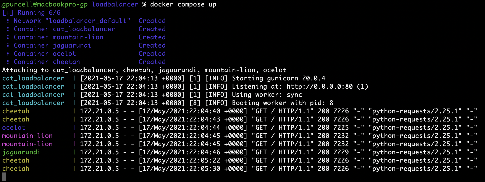

# Load Balancer

This load balancer distributes requests between multiple Docker containers running Nginx.

For the single container version of this load balancer, see [v1.3.0](https://github.com/mkorangestripe/loadbalancer/tree/v1.3.0)

To start this application with **docker-compose**:

```shell script
docker compose up
```

To start this application with **docker**:

```shell script
docker run -d -p 80:80 --name cat_loadbalancer --hostname cat_loadbalancer \
mkorangestripe/loadbalancer:2.0.0  # at least version 2

docker run -d -P --name cheetah --hostname cheetah nginxdemos/hello
docker run -d -P --name ocelot --hostname ocelot nginxdemos/hello
docker run -d -P --name mountain-lion --hostname mountain-lion nginxdemos/hello
docker run -d -P --name jaguarundi --hostname jaguarundi nginxdemos/hello
```

To see the response from the loadbalancer, use curl or a browser.  Run the curl command or reload the page multiple times to see a unique page from each container.

```shell script
curl -s 127.0.0.1 | grep -e 'Server' -e Date | awk '{print $2,$3}'
```



For **AWS ECS** deployment with terraform, see https://github.com/mkorangestripe/devops/tree/master/terraform

For **Kubernetes** deployment, see https://github.com/mkorangestripe/devops/tree/master/kubernetes